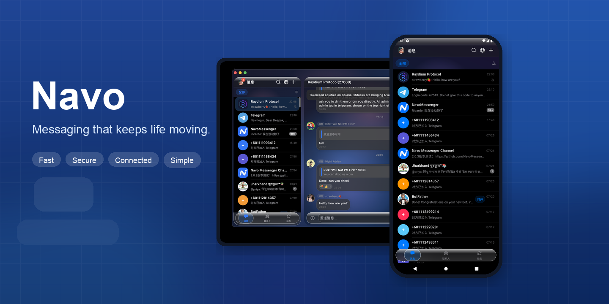
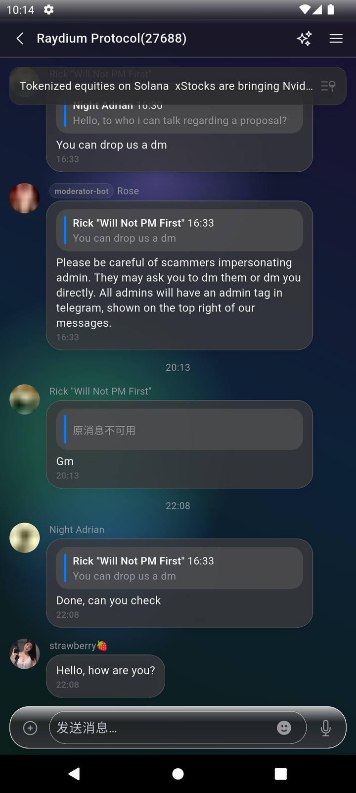
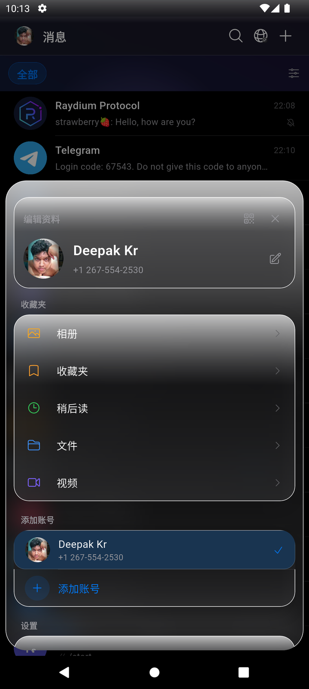
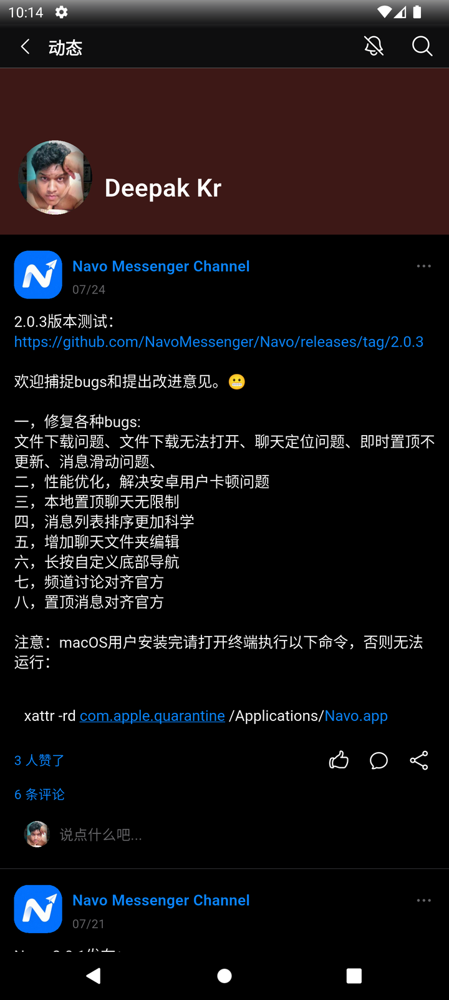
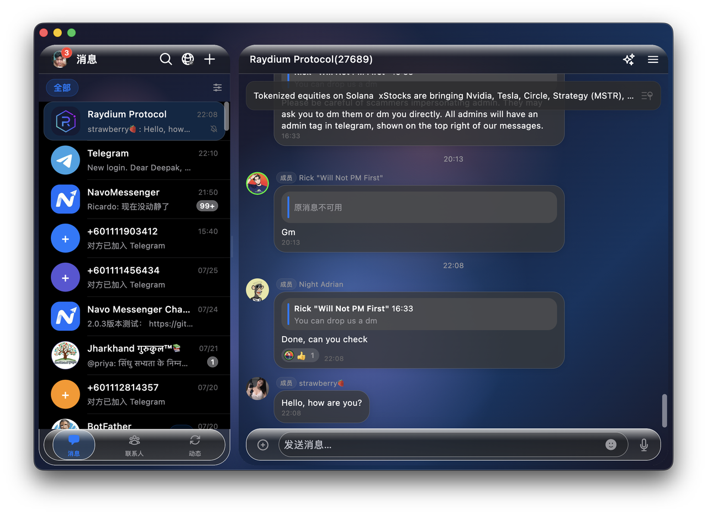
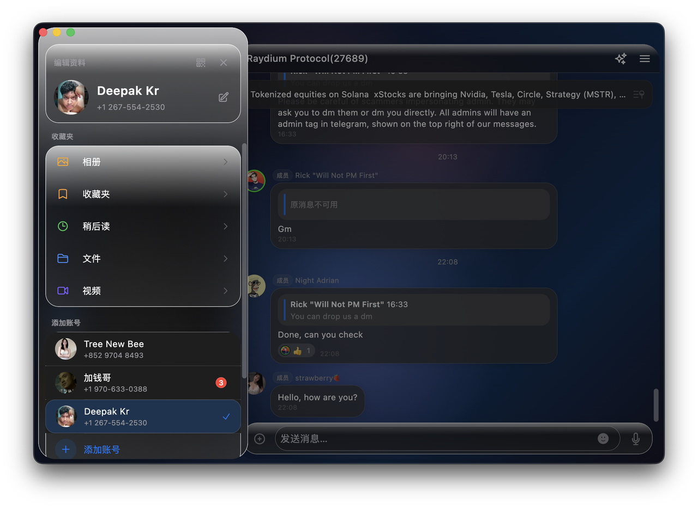
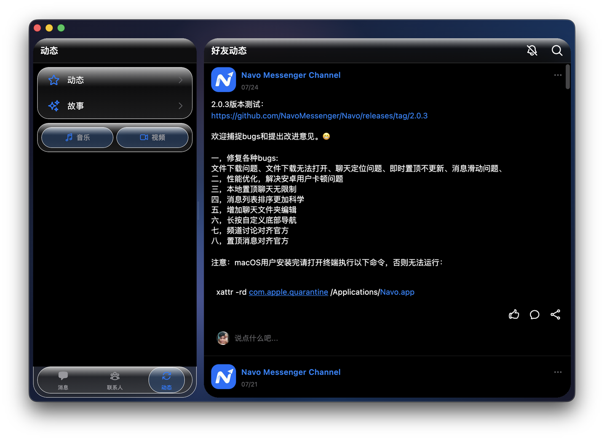

  

# Navo

**English** | [简体中文](README.zh-CN.md)

Independent, unofficial messenger for **Android, iOS, Windows, and macOS**. Sign in with your existing Telegram account — built with **Flutter** on **[TDLib](https://core.telegram.org/tdlib)**.

## Download Navo

Choose your platform and install Navo in one click.

<table width="100%">
  <tr>
    <td align="center" width="33%">
      
       
      <strong>Android</strong> 
      <a href="https://play.google.com/store/apps/details?id=im.navo.app"><strong>Install&nbsp;from&nbsp;Google&nbsp;Play&nbsp;→</strong></a>
    </td>
    <td align="center" width="34%">
      
       
      <strong>iPhone, iPad &amp; Mac</strong> 
      <a href="https://testflight.apple.com/join/mC3AXH8K"><strong>Join&nbsp;the&nbsp;TestFlight&nbsp;beta&nbsp;→</strong></a>
    </td>
    <td align="center" width="33%">
      
        
      <strong>Windows &amp; macOS</strong> 
      <a href="https://github.com/NavoMessenger/Navo/releases/latest"><strong>Download&nbsp;the&nbsp;latest&nbsp;installer&nbsp;→</strong></a>
    </td>
  </tr>
</table>

  <a href="https://www.navo.im/download.html"><strong>View all download options and installation help →</strong></a>

> **Disclaimer** — Navo is an **independent, unofficial** project. It is **not affiliated with, endorsed by, or connected to Telegram**. "Telegram" is a trademark of its respective owner. Use at your own risk and in accordance with Telegram's [Terms of Service](https://telegram.org/tos) and [API Terms](https://core.telegram.org/api/terms).

## Quick start

1. **Android** — Install from [Google Play](https://play.google.com/store/apps/details?id=im.navo.app), or grab the APK from [Latest Release](https://github.com/NavoMessenger/Navo/releases/latest).
2. **iOS** — Join the public beta on [TestFlight](https://testflight.apple.com/join/mC3AXH8K).
3. **Windows / macOS** — Download the installer from [Latest Release](https://github.com/NavoMessenger/Navo/releases/latest). Apple users can also join the [TestFlight beta](https://testflight.apple.com/join/mC3AXH8K) when a compatible build is available.
4. **Details** — See [docs/download.md](docs/download.md) or the [website download page](https://www.navo.im/download.html).

## All download options

| Platform | How to get it | Status |
|----------|---------------|--------|
| **Android** | [Google Play](https://play.google.com/store/apps/details?id=im.navo.app) · [Release APK](https://github.com/NavoMessenger/Navo/releases/latest) | Available |
| **Windows** | [GitHub Release](https://github.com/NavoMessenger/Navo/releases/latest) (`.exe` / `.msi`) | Available |
| **macOS** | [GitHub Release](https://github.com/NavoMessenger/Navo/releases/latest) (`.dmg` / `.zip`) | Available |
| **iOS** | [TestFlight](https://testflight.apple.com/join/mC3AXH8K) | Public beta |

iOS is currently distributed as a public beta through [TestFlight](https://testflight.apple.com/join/mC3AXH8K). TestFlight availability and supported devices are shown by Apple after you open the invitation. Developers who need to build from source (Apple Developer Program required) can see [docs/build.md#ios](docs/build.md#ios).

- Website: <https://www.navo.im>
- Privacy Policy: <https://www.navo.im/privacy.html>
- Terms of Service: <https://www.navo.im/terms.html>

## Features

Sign in with your existing Telegram account to message friends and groups in a clean, focused interface. Stay on the Telegram network you already use — with a lighter client experience.

- Chat list and conversations with live updates
- Stickers and animated stickers (`.tgs` / `.webm`)
- Voice notes, photos, files, and media
- Polls, checklists, and location sharing
- Contacts, profiles, and Stories-style moments
- One-to-one voice and video calls
- Light and dark themes, plus customizable app icons
- Privacy-minded controls such as keyword blocking and reporting tools

## Screenshots

### Phone

  
  
  
  

### macOS

  
  
  

## Roadmap

- **Android** — Available on Google Play
- **Windows / macOS** — Prebuilt packages via [GitHub Releases](https://github.com/NavoMessenger/Navo/releases/latest)
- **iOS** — Public beta available through [TestFlight](https://testflight.apple.com/join/mC3AXH8K); App Store release planned
- Contributions welcome via Issues and Pull Requests

## Why open source

Navo is open source so you can inspect how it talks to Telegram via TDLib, audit privacy-related behavior, and build trust beyond a store listing alone. The project builds on open-source upstream work and ships no proprietary assets from third-party apps.

## Building from source

**End users should prefer [GitHub Releases](https://github.com/NavoMessenger/Navo/releases/latest).** Building from source is for developers and contributors.

Need to compile for Android, Windows, or macOS? See the full guide:

**[docs/build.md](docs/build.md)** — prerequisites, Telegram API credentials, native TDLib build, signing, and CI.

iOS builds require an Apple Developer Program membership. End users can install the current public beta through [TestFlight](https://testflight.apple.com/join/mC3AXH8K).

## Architecture (brief)

- **Flutter** UI (`lib/`), state via `provider` + `ChangeNotifier`
- **TDLib** via Dart FFI (`lib/tdlib/`); native `libtdjson` is built from source per platform (not committed)
- Adaptive light / dark theming; Cupertino / custom UI components

## Community

If Navo is useful, please **[star the repo](https://github.com/NavoMessenger/Navo)** so others can find it. Feedback and bug reports are welcome in [Issues](https://github.com/NavoMessenger/Navo/issues).

## License & credits

Navo builds on **[Mithka](https://github.com/iebb/mithka)** by [iebb](https://github.com/iebb) — thank you for the open Flutter + TDLib foundation (BSD-3-Clause). Navo continues as an independent project with its own branding and platform support. TDLib is © Telegram, used under its own license. Navo ships no proprietary assets or trademarks from third-party apps.

---

Navo is **not affiliated with, endorsed by, or connected to Telegram**. "Telegram" is a trademark of its respective owner. Navo is an unofficial client. Use of Telegram's network is subject to Telegram's Terms of Service. You are responsible for complying with applicable laws and Telegram's rules.

[Privacy Policy](https://www.navo.im/privacy.html) · [Terms of Service](https://www.navo.im/terms.html) · [Website](https://www.navo.im)
