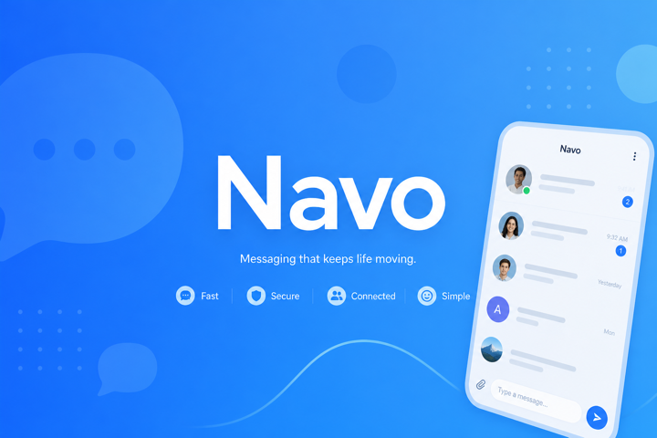
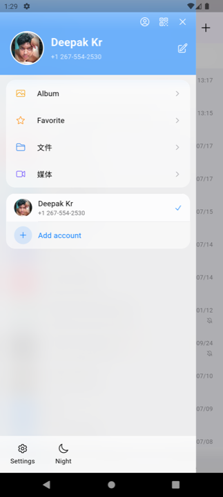
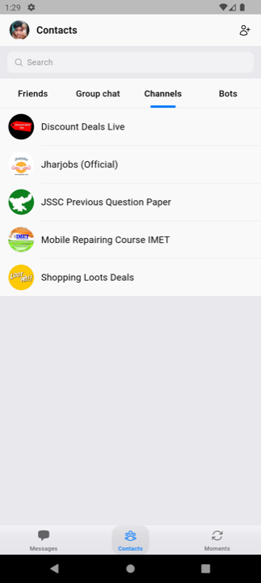
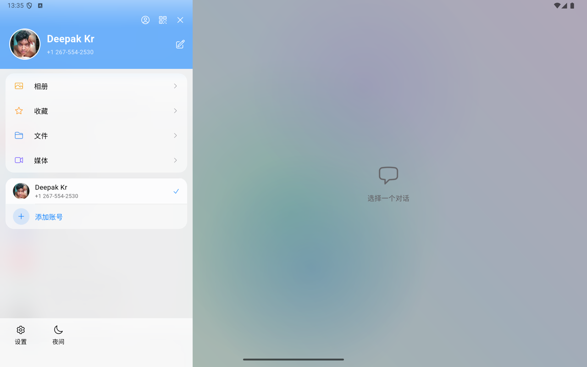
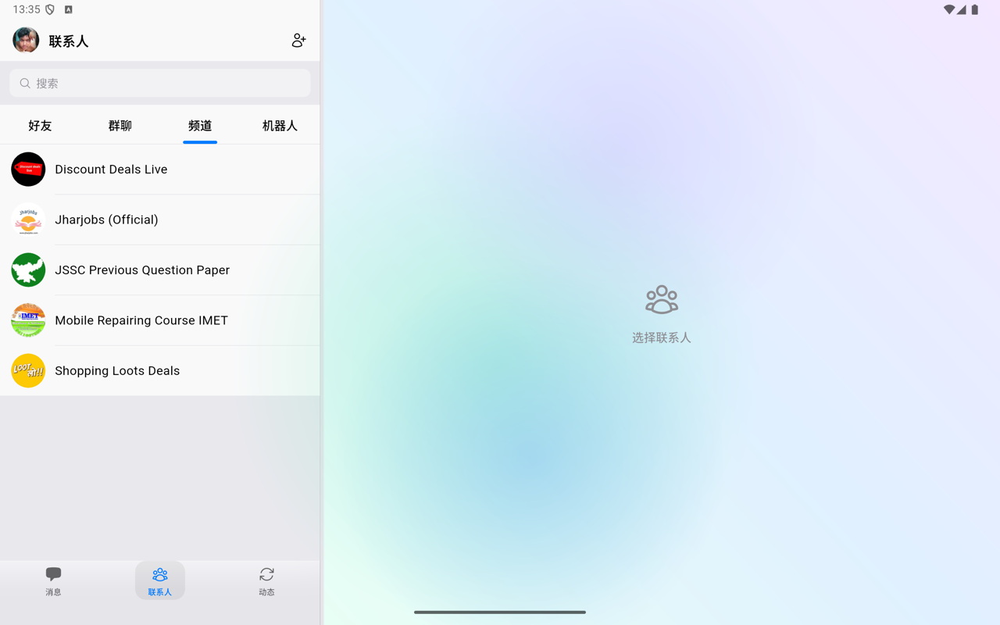
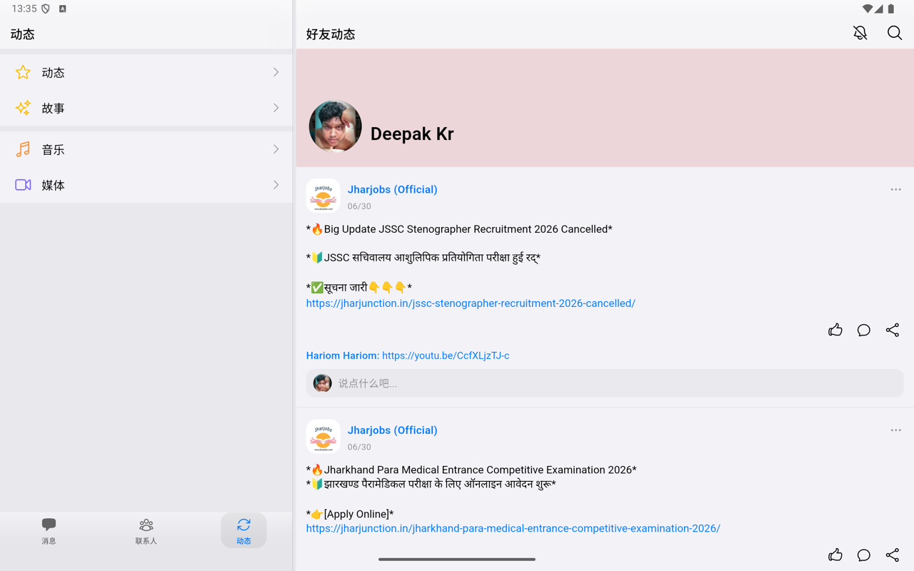

  

# Navo

[English](README.md) | **简体中文**

独立、非官方的 **Android / Windows / macOS** 跨平台即时通讯客户端。使用现有 Telegram 账号登录 — 基于 **Flutter** 与 **[TDLib](https://core.telegram.org/tdlib)** 构建。

> **免责声明** — Navo 是一个**独立、非官方**项目，**与 Telegram 无隶属、背书或关联关系**。"Telegram" 为其各自所有者的商标。请自行承担风险，并遵守 Telegram 的[服务条款](https://telegram.org/tos)与 [API 条款](https://core.telegram.org/api/terms)。

## 快速开始

1. **Android** — 从 [Google Play](https://play.google.com/store/apps/details?id=im.navo.app) 安装，或从 [Latest Release](https://github.com/NavoMessenger/Navo/releases/latest) 下载 APK。
2. **Windows / macOS** — 从 [Latest Release](https://github.com/NavoMessenger/Navo/releases/latest) 下载安装包。
3. **详细说明** — 见 [docs/download.md](docs/download.md) 或[官网下载页](https://www.navo.im/download.html)。

## 下载

| 平台 | 获取方式 | 状态 |
|------|----------|------|
| **Android** | [Google Play](https://play.google.com/store/apps/details?id=im.navo.app) · [Release APK](https://github.com/NavoMessenger/Navo/releases/latest) | 可用 |
| **Windows** | [GitHub Release](https://github.com/NavoMessenger/Navo/releases/latest)（`.exe` / `.msi`） | 可用 |
| **macOS** | [GitHub Release](https://github.com/NavoMessenger/Navo/releases/latest)（`.dmg` / `.zip`） | 可用 |
| **iOS** | App Store | **即将推出** — Apple 开发者账号申请中 |

iOS 暂未上架 App Store，目前**不提供**面向普通用户的 TestFlight 或侧载安装包。可 Star 本仓库或关注 [Releases](https://github.com/NavoMessenger/Navo/releases) 获取上架通知。开发者如需自行构建 iOS（需 Apple Developer Program），见 [docs/build.md#ios](docs/build.md#ios)。

- 官网：<https://www.navo.im>
- 隐私政策：<https://www.navo.im/privacy.html>
- 服务条款：<https://www.navo.im/terms.html>

## 功能

使用现有 Telegram 账号登录，在简洁、专注的界面中与好友和群组聊天。继续使用你已熟悉的 Telegram 网络 — 体验更轻量的客户端。

- 聊天列表与实时会话更新
- 贴纸与动态贴纸（`.tgs` / `.webm`）
- 语音消息、图片、文件与媒体
- 投票、清单与位置分享
- 联系人、个人资料与 Stories 风格动态
- 一对一语音与视频通话
- 浅色 / 深色主题，以及可自定义应用图标
- 注重隐私的功能，如关键词屏蔽与举报工具

## 截图

### 手机

  
  
  

### 平板

  
  
  

## 路线图

- **Android** — 已上架 Google Play
- **Windows / macOS** — 通过 [GitHub Releases](https://github.com/NavoMessenger/Navo/releases/latest) 提供预编译包
- **iOS** — Apple Developer 账号申请中，App Store 即将推出
- 欢迎通过 Issue 与 Pull Request 参与贡献

## 为什么开源

Navo 开源，便于你检查它如何通过 TDLib 连接 Telegram、审计与隐私相关的行为，并在商店页面之外建立信任。本仓库仅包含原创、独立编写的代码 — 不含第三方应用的专有资源。

## 从源码构建

**普通用户请优先使用 [GitHub Releases](https://github.com/NavoMessenger/Navo/releases/latest)。** 从源码构建面向开发者与贡献者。

需要为 Android、Windows 或 macOS 编译？请参阅完整指南：

**[docs/build.md](docs/build.md)** — 环境依赖、Telegram API 凭证、原生 TDLib 构建、签名与 CI。

iOS 构建需 Apple Developer Program 会员资格；App Store 版本筹备中。普通用户请等待 App Store 上架。

## 架构（简要）

- **Flutter** UI（`lib/`），状态管理使用 `provider` + `ChangeNotifier`
- **TDLib** 通过 Dart FFI（`lib/tdlib/`）；各平台的原生 `libtdjson` **从源码编译**（不提交到仓库）
- 自适应浅色 / 深色主题；Cupertino / 自定义 UI 组件

## 社区

如果觉得 Navo 有帮助，欢迎 **[Star 本仓库](https://github.com/NavoMessenger/Navo)**，让更多人发现它。问题与建议请到 [Issues](https://github.com/NavoMessenger/Navo/issues) 反馈。

## 许可与致谢

TDLib © Telegram，按其自身许可使用。本仓库仅包含原创、独立编写的代码；不包含任何第三方应用的专有资源或商标。

---

Navo **与 Telegram 无隶属、背书或关联关系**。"Telegram" 为其各自所有者的商标。Navo 是非官方客户端。使用 Telegram 网络须遵守 Telegram 服务条款。你有责任遵守适用法律与 Telegram 规则。

[隐私政策](https://www.navo.im/privacy.html) · [服务条款](https://www.navo.im/terms.html) · [官网](https://www.navo.im)
